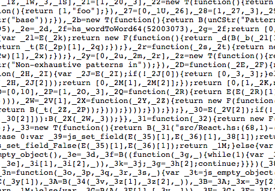

---

# React-Haskell

---

## Hi, My Name is Joel

^ I have a confession

---

## Hi, My Name is Joel

### ... and I Use Haskell

---

# Haskell

* statically typed
* lazy
* purely functional

---

# Haskell

* ~~statically typed~~
* ~~lazy~~
* ~~purely functional~~
* really cool

---

# Haste

* dialect of Haskell
* runs in browser

---

# Haste



^ resulting code is smaller than expected
but hard to debug

---

# Blaze-Html

```haskell
sample :: Html
sample = p ! class_ "styled" $ em "Basic Algebra"
```
becomes

```html
<p class="styled">
    <em>Basic Algebra</em>
</p>
```

^ was inspired by existing library - blaze-html
produces a string, runs on server

---

# React-Haskell

```haskell
sample :: React
sample = p <! className "styled" $ em "Basic Algebra"
```
becomes

```html
<p class="styled">
    <em>Basic Algebra</em>
</p>
```

^ this produces react on the client

---

# Put It On the Page

```haskell
main :: IO ()
main = do
    Just elem <- elemById "id"
    render elem sample
```

^ elemById is getElementById
render is React's render

---

# More Complicated

```haskell
sample :: React
sample = div <! className "beautify" $ do
    "Khan Academy"
    
    input
    
    "Rewritten in Haskell"
```

^ The start of the Haskell rewrite Emily and I have been planning

---

# Controlled Component

```haskell
view :: Elem -> JSString -> IO ()
view elem str = render elem $
    div $ do
        "Khan Academy"

        input <! onChange (view elem . targetValue)
        
        text str        
```

^ onChange takes the action that should happen

---


---

# Let's Make That Easier

---

# Stateful Component Redux

```haskell
view :: StatefulReact JSString
view = div $ do
    "Khan Academy"
        
    input <! onChange' (updateState . targetValue)
        
    text str
```

^ onChange' updates state

---

# Lifecycle Methods

`componentDidMount`, `componentWillUnmount`, ...

## ?

---

# Questions?